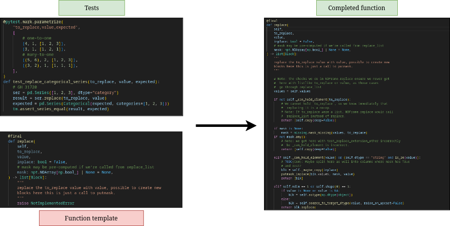

# Debugger Enhanced Code Completion

## Project Overview

This project aims to evaluate and improve code completion capabilities by incorporating debugging information such as stack traces and variable states into large language models (LLMs). The system will leverage debug-time context to generate more accurate and contextually appropriate code completions at the repository level.

### Research Objectives

- Determine if and how debugging information improves code completion accuracy
- Identify which types of debugging data provide the most value to LLMs
- Develop a methodology for effectively feeding debugging context to code completion models
- Create a practical implementation in the form of a VSCode extension
- Compare performance against baseline models without debugging and code completion systems (GitHub Copiler, Cursor) 

### Technical Objectives

Develop a VSCode extension that will be able to generate necessary code to pass defined unit tests.

Flow from the user perspective:
1. User selects a function signature and associated tests
2. System runs tests with debugging enabled to collect context information
3. Debug data is processed and combined with code context. Combined context is sent to LLM for code completion
4. Generated code is returned and presented to the user. User can accept, modify, or request refinements

### Reproducibility

To build programmer Doxygen documentation run `nix build .#docs`.
